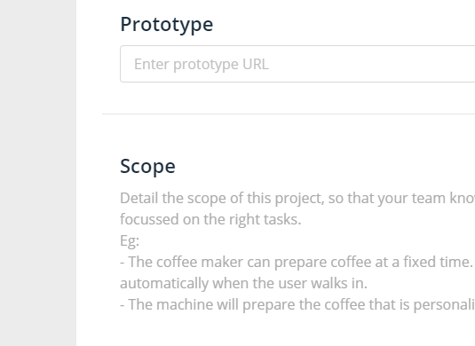

# Another page displaying code

Bla bla bla. And here the code follows:

```cpp
#include <iostream>
using namespace std;

int main()
{
  int n, i;
  bool isPrime = true;

  cout << "Enter a positive integer: ";
  cin >> n;

  for(i = 2; i <= n / 2; ++i)
  {
      if(n % i == 0)
      {
          isPrime = false;
          break;
      }
  }
  if (isPrime)
      cout << "This is a prime number";
  else
      cout << "This is not a prime number";

  return 0;
}
```

Below, you can see a screenshot and its caption:



This program takes a positive integer from user and stores it in variable `n`.

Then, `for` loop is executed which checks whether the number entered by user is perfectly divisible by `i` or not.  


You can add extra code by using the inline MD highlighting:

```text
Inline `code` has `back-ticks around` it.
```

Which produces this output:

> Inline `code` has `back-ticks around` it.

Pretty cool, right?


Let's try to point to a previous page – [like this one](landing-page.md#get-cakes). It's pretty simple:

1. Press `Ctrl + K`
2. Start typing the page title or URL, as shown below:


3. Click the Heading you want and that's it! Pretty straightforward ;\)

This last line here has been added directly in GitHub :)
